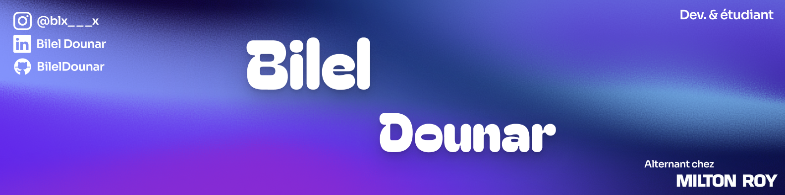

# Salut, moi c’est Bilel 👋🏼
🎓 En alternance chez Milton Roy Europe (Rouen) et en formation DWWM  
🧠 Passionné de développement web & mobile, en quête de skills solides  
🛠️ Actuellement sur plusieurs projets en React, Next.js, Node & MongoDB

---

# 💻 Tech Stack préféré :

        
        
          

